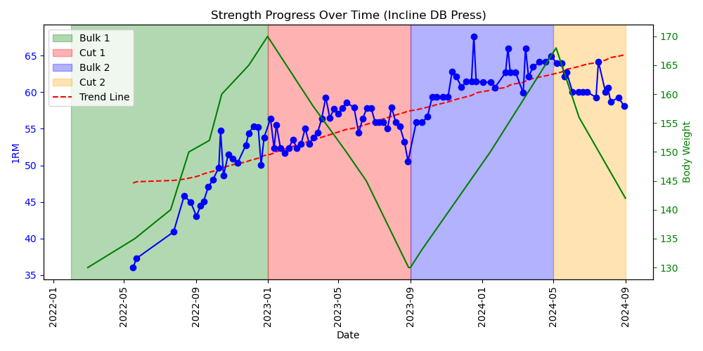
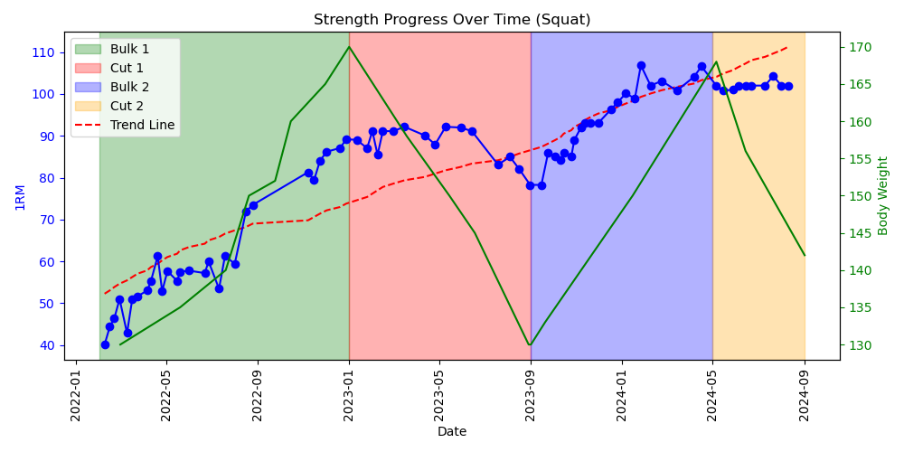
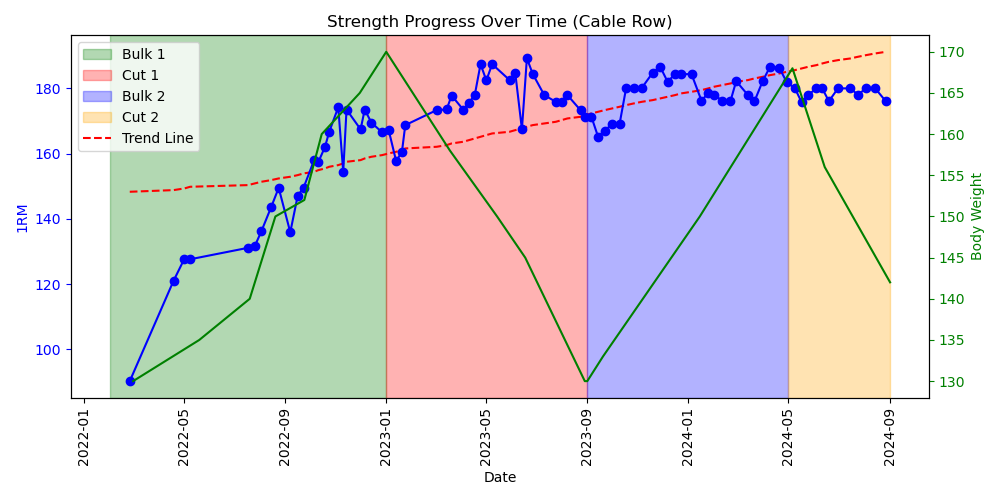

# FitnessTracker
This is my Fitness Progress Tracker. The program uses fitness data that I have collected to easily analyze and visualize my strength training progress since the beginning of 2022. Every lifting session, I track how many sets, reps, and how much weight I do for each exercise. By interpreting my exercise tracking notes using string manipulation, I am able to create a JSON file with a Python script to organize my data. Another Python script is able to easily read and interpret this JSON to display a graph showing strength trends / progress over time. 

The graph displays an estimated one rep max for each time I performed the chosen exercise. It also displays my bodyweight over time, highlights bulking / cutting periods, and calculates a trend line for the strength data.  

Examples shown below

